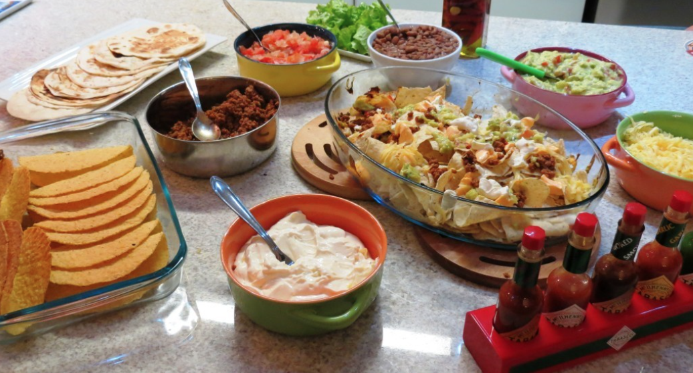

# Taco toppings

To make for 5 people - 500g of minced meat (can be vegan), 1 filling and 200g of grated mozzarella.

For 10 people 950g of meat, 2 fillings and 300g of grated mozzarella.

## Guacamole

### Ingredients

- 2 small ripe avocados
- 1 clove of garlic
- 1/2 onion
- 1 finely chopped seedless tomato
- 1 and ½ Sicilian lemon juice
- 6 tablespoons of olive oil
- 2 finely chopped seedless chili peppers
- 1 tablespoon salt
- Coriander (recommended measure 1/2 cup)
- Parsley and black pepper to taste

### Instructions

1. Blend garlic, onion, lemon juice, olive oil and salt in a blender.
1. Add the avocado pulp and some of the parsley and coriander and blend.
1. Pour the mixture into a bowl, add the tomato, pepper and the other chopped parsley and coriander.
1. Stir with a fork.
1. Refrigerate until ready to serve.

### Remarks and references

It's a great snack to accompany caipirinhas or [mojitos](drinks/mojito.md) (**can reuse the 1/2 lemon left**).

## Chilli con/sin carne

### Ingredients

- 500g minced meat/pea meat (vegan)
- 4 cups of cooked and seasoned red beans
- 1 handful of coriander
- Pepper to taste
- Optional - canned corn
- Optional - tomato sauce

### Instructions

- Put the (pre-cooked) beans in a saucepan and season with coriander and plenty of pepper.
- Cook well so that the beans thicken.
